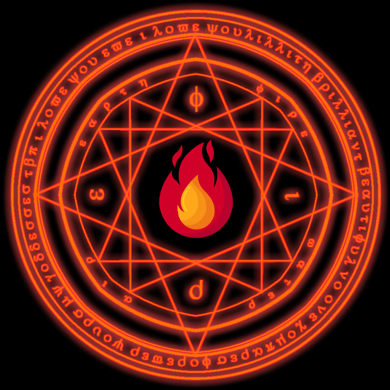

## 🔥 StMary's Gate RPG Bot

    

🎮 StMary's Gate is a text-based RPG adventure bot for Discord.

## 🎋 Overview

StMary's Gate is an immersive text-based RPG adventure set in a medieval fantasy world. Embark on epic quests, explore mysterious lands, battle fearsome creatures, and interact with intriguing characters. Forge your own path and become a legendary hero in the realm of StMary.

🔥 Features:
- Engaging storylines and quests.
- Character customization and progression.
- Intriguing NPCs with unique dialogues.
- Richly detailed medieval fantasy world.

## Getting Started

🚀 To run the StMary's Gate RPG Bot on your Discord server, follow these steps:

1. *currently you can't run StMary's Gate by yourself, but soon you will can!*

## ⚖️ License

This project is licensed under the [MIT License](LICENSE).

## 🤝 Contributing

Feel free to contribute to the development of StMary's Gate RPG Bot by submitting issues or pull requests. Your contributions are greatly appreciated! 🙌

## ☎️ Contact

If you have any questions or need assistance, feel free to create an issue!

### Happy adventuring! 🗡️🛡️
