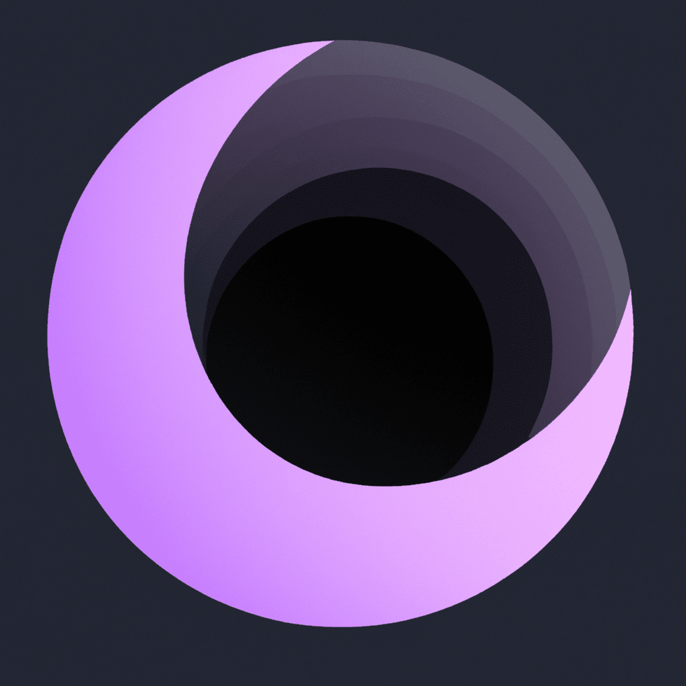

<!-- Improved compatibility of back to top link: See: https://github.com/othneildrew/Best-README-Template/pull/73 -->

<!-- PROJECT LOGO -->
 

  

<h3 align="center">Luna</h3>

  

    The Game Server of Saint Mary's Gate game.
     
    <a href="https://docs.stmarygate.com"><strong>Explore the docs »</strong></a>
     
     
    <a href="https://github.com/St-Mary/Luna/issues">Report Bug</a>
    ·
    <a href="https://github.com/St-Mary/Luna/issues">Request Feature</a>
    ·
    <a href="https://status.stmarygate.com">Status</a>
  

<!-- TABLE OF CONTENTS -->

  
Table of Contents

  <ol>
    <li>
      <a href="#about-the-project">About Luna</a>
      <ul>
        <li><a href="#built-with">Built With</a></li>
      </ul>
    </li>
    <li>
      <a href="#getting-started">Getting Started</a>
      <ul>
        <li><a href="#prerequisites">Prerequisites</a></li>
        <li><a href="#installation">Installation</a></li>
      </ul>
    </li>
    <li><a href="#roadmap">Roadmap</a></li>
    <li><a href="#contributing">Contributing</a></li>
    <li><a href="#license">License</a></li>
    <li><a href="#contact">Contact</a></li>
    <li><a href="#acknowledgments">Acknowledgments</a></li>
  </ol>

<!-- ABOUT LUNA -->

## About Luna

Luna, the dynamic and immersive game server powered by StMary’s Gate. Luna
serves as the heartbeat of our gaming ecosystem, providing a seamless and
thrilling experience for players worldwide.

### Key Features:

- SSL Integration
- Packet Management
- Password Hashing
- JWT Authentication
- PostgreSQL Database

(<a href="#readme-top">back to top</a>)

### Built With

[![Java][Java]][Java-url]
[![Gradle][Gradle]][Gradle-url]

(<a href="#readme-top">back to top</a>)

<!-- GETTING STARTED -->

## Getting Started

Currently, this project is not ready for use. Please check back later.

### Prerequisites

Not ready yet

### Installation

1. Not ready yet

(<a href="#readme-top">back to top</a>)

<!-- ROADMAP -->

## Roadmap

<!-- - [ ] Feature 1-->
<!-- - [ ] Feature 2-->
<!-- - [ ] Feature 3-->
<!--    - [ ] Nested Feature-->

See the [open issues](https://github.com/github_username/repo_name/issues) for a
full list of proposed features (and known issues).

(<a href="#readme-top">back to top</a>)

<!-- CONTRIBUTING -->

## Contributing

Contributions are what make the open source community such an amazing place to
learn, inspire, and create. Any contributions you make are **greatly appreciated
**.

If you have a suggestion that would make this better, please fork the repo and
create a pull request. You can also simply open an issue with the tag "
enhancement".
Don't forget to give the project a star! Thanks again!

1. Fork the Project
2. Create your Feature Branch (`git checkout -b feature/AmazingFeature`)
3. Commit your Changes (`git commit -m 'Add some AmazingFeature'`)
4. Push to the Branch (`git push origin feature/AmazingFeature`)
5. Open a Pull Request

(<a href="#readme-top">back to top</a>)

<!-- LICENSE -->

## License

Distributed under the Apache Licence v2.0. See `LICENSE` for more information.

(<a href="#readme-top">back to top</a>)

<!-- CONTACT -->

## Contact

Léa - [Discord](https://discord.com/users/985986599995187270) - [contact@aikoo.me](mailto:contact@aikoo.me)

Saint Mary's Gate - [contact@stmarygate.com](mailto:contact@stmarygate.com)

Project Link: [https://github.com/St-Mary/Luna](https://github.com/St-Mary/Luna)

(<a href="#readme-top">back to top</a>)

<!-- ACKNOWLEDGMENTS -->

## Acknowledgments

* [RedBoxing](https://github.com/RedBoxing)

(<a href="#readme-top">back to top</a>)

<!-- MARKDOWN LINKS & IMAGES -->
<!-- https://www.markdownguide.org/basic-syntax/#reference-style-links -->

[contributors-shield]: https://img.shields.io/github/contributors/St-Mary/Luna.svg?style=for-the-badge

[contributors-url]: https://github.com/St-Mary/Luna/graphs/contributors

[forks-shield]: https://img.shields.io/github/forks/St-Mary/Luna.svg?style=for-the-badge

[forks-url]: https://github.com/St-Mary/Luna/network/members

[stars-shield]: https://img.shields.io/github/stars/St-Mary/Luna.svg?style=for-the-badge

[stars-url]: https://github.com/St-Mary/Luna/stargazers

[issues-shield]: https://img.shields.io/github/issues/St-Mary/Luna.svg?style=for-the-badge

[issues-url]: https://github.com/St-Mary/Luna/issues

[license-shield]: https://img.shields.io/github/license/St-Mary/Luna.svg?style=for-the-badge

[license-url]: https://github.com/St-Mary/Luna/blob/master/LICENSE

[Java-url]: https://www.java.com/fr/

[Java]: https://img.shields.io/badge/Java-ED8B00?style=for-the-badge&logo=openjdk&logoColor=white

[Gradle]: https://img.shields.io/badge/gradle-02303A?logo=gradle&style=for-the-badge&logoWidth=25

[Gradle-url]: https://gradle.org/
